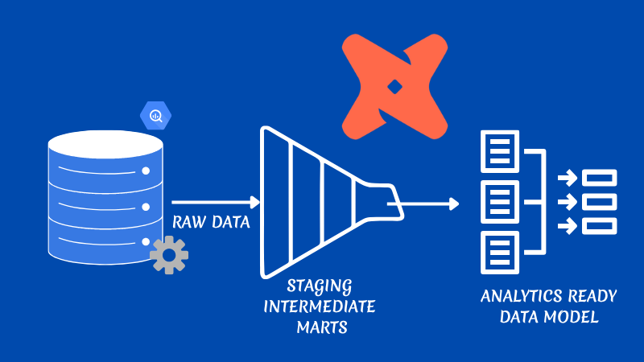
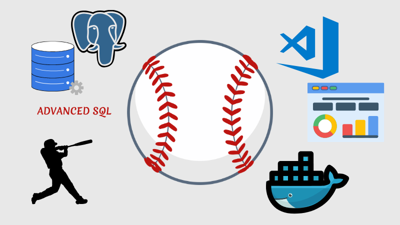
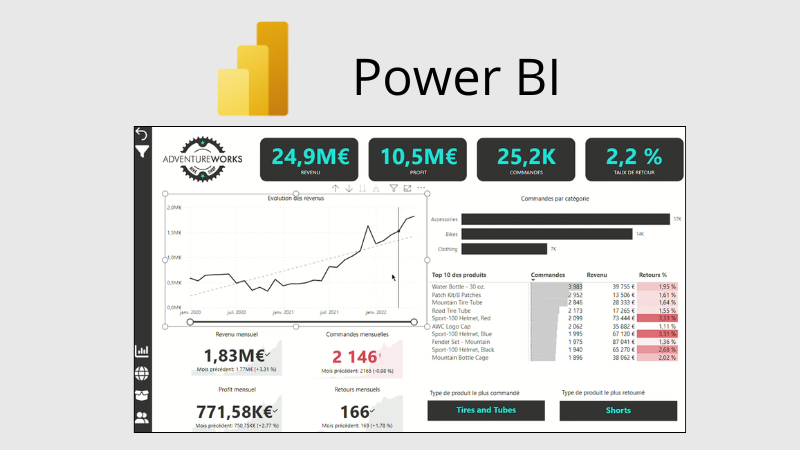

# Hi there, I'm Célia 👋
### Analytics Engineer | Data Engineer | Modern Data Stack Enthusiast

  
I am a passionate Analytics Engineer with over 4 years of experience in data, including a strong background as a Data Analyst. I specialize in transforming raw data into reliable, actionable insights by designing and optimizing data models and pipelines. 
I work with modern data tools such as dbt, Snowflake, BigQuery, and AWS, leveraging modern data architectures to build scalable and efficient data solutions in the cloud. 
With a solid analytical foundation and an engineering mindset, I focus on delivering clean, well-structured, and business-ready datasets. I am also continuously learning and improving my skills to stay aligned with the latest trends and best practices in the data ecosystem.

---

  
### 🌐 Connect with me

### 🛠 Tech Stack
**Languages & Tools**

  
  
  
  
  
  
  
  

**Strengths**
- Advanced SQL & Data Modeling (star, snowflake schema)
- Modern Data Stack & ELT
- Analytics Engineering (dbt)  
- Cloud Data Platforms (AWS, GCP, Snowflake)
- Data Quality & Governance (dbt tests, lineage)
- Version Control (Git & GitHub)
- Data Visualization

---
### 🚀 Projects & Practice

|  |  |  |
| :---: | :---: | :---: |
| **dbt Fundamentals — Jaffle Shop** | **MLB Advanced SQL Analysis** | **AdventureWorks BI Solution** |
| **Description:** End-to-end transformation pipeline from raw data to analytics-ready marts. **Tech:** dbt, SQL, BigQuery **Strategy:** Modular SQL, Data Quality, Testing, Version Control.|**Description:** Complex performance analytics focused on athlete metrics and game outcomes. **Tech:** PostgreSQL 15 (via Docker) **Strategy:** Advanced SQL (Windows functions, CTE, conditional aggregations, joins Optimization).|**Description:** Enterprise-grade BI ecosystem converting raw CSVs into executive KPIs. **Tech:** Power BI, DAX, Power Query **Strategy:** ETL Process, Star Schema, Relational Data Modeling (1:N).| 
|  |  |  |
| **Maven Market: Global Grocery** | **Coffee Shop Sales Analysis** | **Global Electronics Retailer** |
| **Description:**  Multi-region sales tracking and customer behavior modeling. **Tech:** Relational Data Modeling, Time Intelligence (DAX), Power Query **Strategy:** Mo| **Description:** Revenue optimization and seasonal sales trends analysis. **Tech:** Excel, Power Pivot **Strategy:** Data Cleaning, Statistical Forecasting.|**Description:** Global profitability analysis and inventory stock optimization. **Tech:** vvv  **Strategy:** Mo |

💡 **Advanced Business Modeling (Excel Expert)**

- [Coffee Shop Sales Analysis](https://github.com/Jb-Analytics/coffee-shop-sales-analysis)  
  Revenue optimization & sales trends analysis  

- [Global Electronics Retailer Analysis](https://github.com/Jb-Analytics/global-electronics-retailer-analysis)  
  Profitability analysis & inventory optimization  

- [HR Survey Analysis](https://github.com/Jb-Analytics/HR-survey-analysis)  
  Employee feedback analysis for actionable insights  

- [US Labor Market Interactive Explorer](https://github.com/Jb-Analytics/US-labor-analysis)  
  Public records → dynamic decision-making tool  

- [Maven Toys: Regional Revenue & Performance Tracker](https://github.com/Jb-Analytics/toy-store-chain-revenue-analysis)  
  Multi-store revenue & KPI tracking

---

## 🎓 Certifications

  
  
  
  

