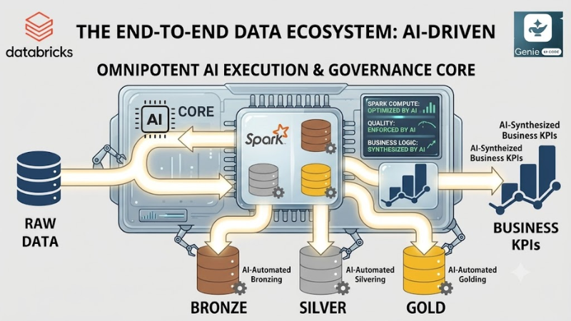
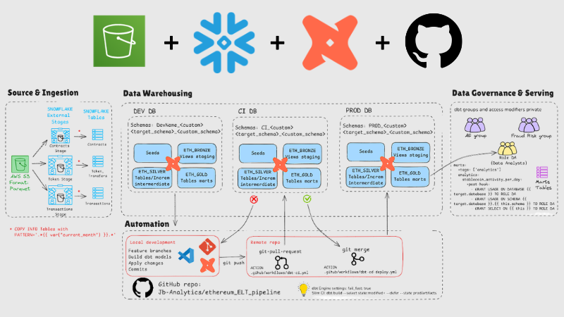
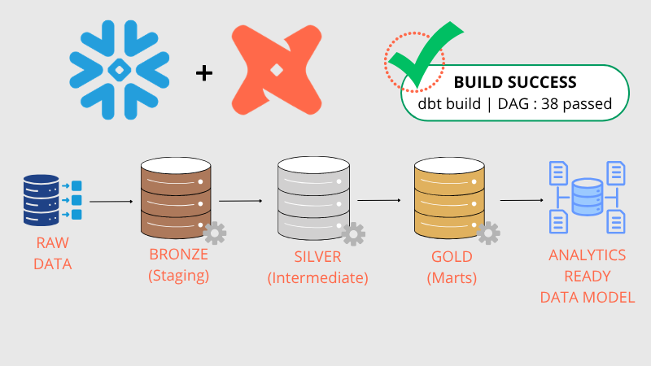
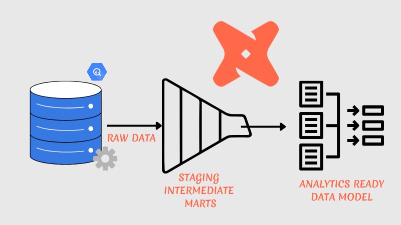
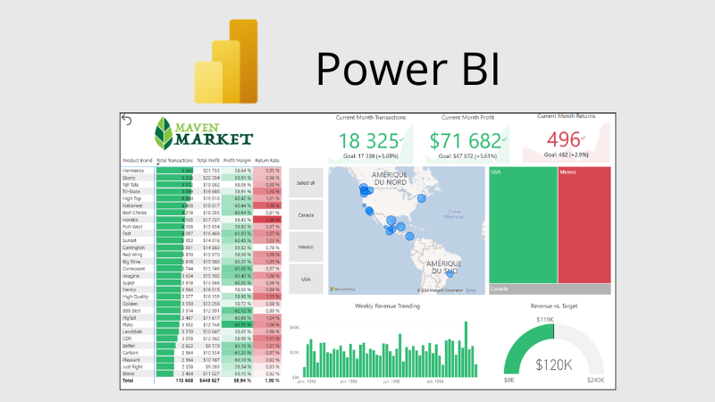
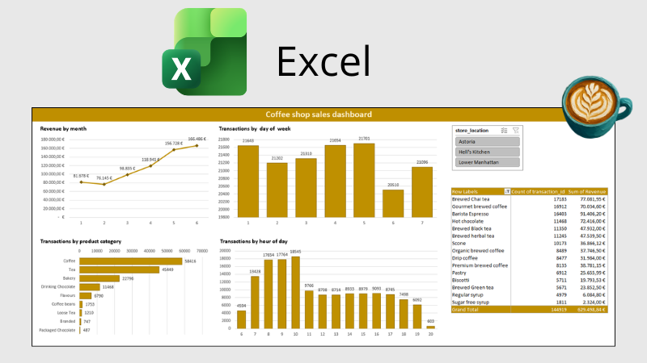
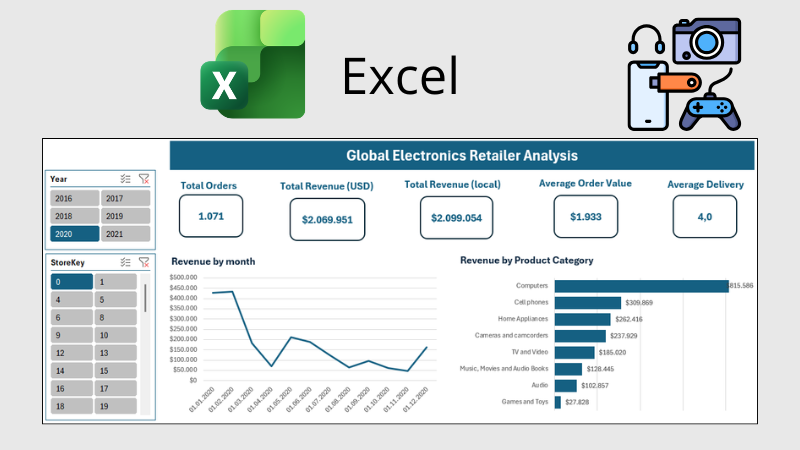
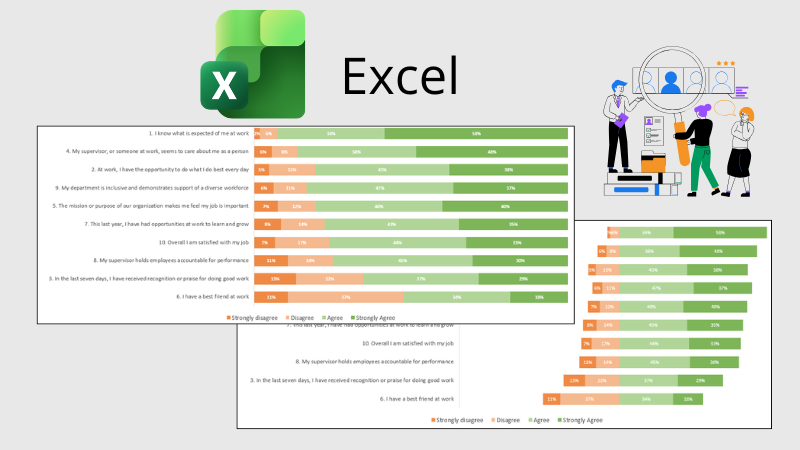
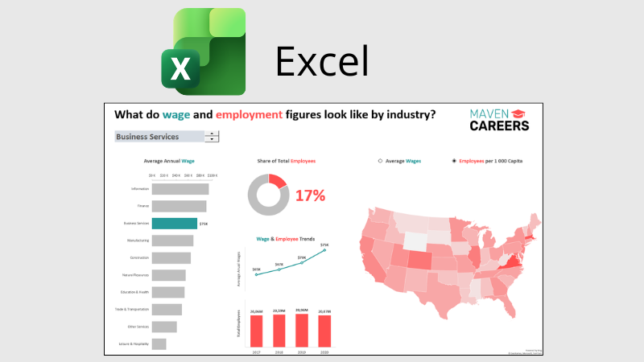
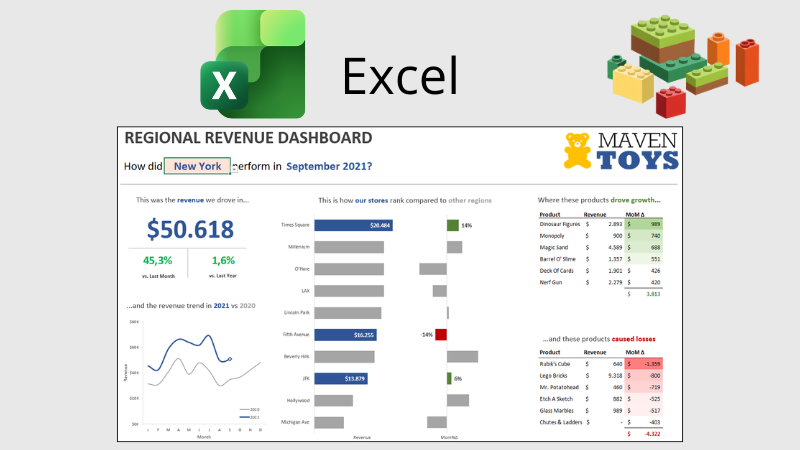

# Hi there, I'm Célia 👋
### Data Engineer | Modern Data Stack

  
Data Engineer building production-grade ELT/streaming pipelines on the Modern Data Stack — Snowflake, dbt, Kafka, PySpark, AWS.
I turn raw, messy data into tested, documented, business-ready models, with a focus on data quality and automation.

**Currently:** deepening my streaming and cloud data engineering skills (Kafka, AWS) and building out this portfolio while looking for my first Data Engineer role.

---

### 🎓 Certifications

  
  
  

---

  
### 🌐 Connect with me

### 🛠 Tech Stack
**Languages & Tools**

    
  
  
  
  
  
  
  
  
  
  

**Strengths**
- **Advanced SQL & Relational Data Modeling** (star schema, snowflake schema)
- **Modern Data Stack & Production ELT Pipelines** (dbt, Snowflake)
- **Analytics Engineering & Data Quality** (dbt tests, CI/CD, documentation)
- **Cloud Data Platforms & Governance** (Snowflake, AWS, GCP)
- **Exploratory Distributed Computing & AI Integration** (Databricks, PySpark, DLT)
- **Version Control** (Git & GitHub)
- **Data Visualization**

### 📊 Activity

  

---

### 🚀 Featured Projects

| 

 | 

 | 

 |
| :--- | :--- | :--- |
| 
<a href="https://github.com/Jb-Analytics/databricks_medallion_ai_pipeline">**Databricks Medallion AI Pipeline**</a>
 | 
<a href="https://github.com/Jb-Analytics/kafka_avro_ksqldb_realtime_pipeline">**Real-Time EV Charging Pipeline (Kafka + Avro + ksqlDB)**</a>
 | 
<a href="https://github.com/Jb-Analytics/ethereum_ELT_pipeline">**Ethereum On-Chain Analytics Pipeline**</a>
 |
| **DESCRIPTION:** Production-grade, AI-augmented data engineering pipeline scaling over 43M rows of relational data on Databricks. **TECH:** Databricks, Delta Live Tables (DLT), PySpark, Delta Lake, Databricks Workflows, Genie Code (Agentic AI). **STRATEGY:** Medallion Architecture, Automated Change Data Capture (SCD Type 1 via DLT `apply_changes`), Dependency-Aware Job Orchestration, and Human-in-the-Loop AI Governance Framework. | **DESCRIPTION:** High-throughput streaming pipeline for an EV charging network, processing live IoT session events on Confluent Cloud. **TECH:** Apache Kafka, Confluent Schema Registry (Avro), ksqlDB, Python. **STRATEGY:** Co-Partitioned Topic Design, Backward-Compatible Schema Evolution (v1→v2), Consumer Group Scaling & Rebalancing, Windowed Stream-Stream & Stream-Table Joins, Tumbling & Hopping Window Aggregations. | **DESCRIPTION:** Enterprise-grade, end-to-end Medallion transformation pipeline scaling high-volume Ethereum blockchain ledger events into optimized analytics marts.  **TECH:** dbt Core, Snowflake, GitHub Actions, SQL, Jinja, AWS S3. **STRATEGY:** Medallion Architecture, FinOps Ingestion Optimization, Slim CI/CD, Automated Schema Cleanup, Security-as-Code. |

---

<b>📂 All Projects</b> — Kafka · dbt · Snowflake · BigQuery · PostgreSQL · Power BI · Excel <i>(click to expand)</i>

 

| 

 | 

 | 

 |
| :--- | :--- | :--- |
| 
<a href="https://github.com/Jb-Analytics/kafka_ksqldb_checkout_payment_pipeline">**Real-Time Checkout & Payment Correlation**</a>
 | 
<a href="https://github.com/Jb-Analytics/snowflake-dbt-tpch-medallion">**Snowflake dbt TPC-H Medallion Pipeline**</a>
 | 
<a href="https://github.com/Jb-Analytics/jaffle-shop-dbt">**dbt Fundamentals — Jaffle Shop**</a>
 |
| **DESCRIPTION:** Real-time e-commerce pipeline correlating checkout and payment events with sub-10-minute latency tolerance. **TECH:** Confluent Cloud Kafka, ksqlDB, Python. **STRATEGY:** Stream-Stream Windowed Join, Event-Time Processing (out-of-order grace period), Business Rule Evaluation, Windowed Materialized Aggregation. | **DESCRIPTION:** End-to-end Medallion pipeline scaling raw TPC-H relational data into a Star Schema. **TECH:** dbt Cloud, Snowflake, SQL, Jinja **STRATEGY:** Medallion Architecture (Bronze/Silver/Gold), Incremental Materialization, Surrogate Keys, Data Quality (16 Models, 20+Tests Passed). | **DESCRIPTION:** End-to-end transformation pipeline from raw data to analytics-ready marts. **TECH:** dbt, SQL, BigQuery **STRATEGY:** Modular SQL, Data Quality, Testing, Version Control. |
| 

 | 

 | 

 |
| 
<a href="https://github.com/Jb-Analytics/Major-League-Baseball-analysis">**MLB Advanced SQL Analysis**</a>
 | 
<a href="https://github.com/Jb-Analytics/AdventureWorks_BI">**AdventureWorks BI Solution**</a>
 | 
<a href="https://github.com/Jb-Analytics/Maven-Market_BI">**Maven Market: Global Grocery**</a>
 |
| **DESCRIPTION:** Complex performance analytics focused on athlete metrics and game outcomes. **TECH:** PostgreSQL 15 (via Docker) **STRATEGY:** Advanced SQL (Windows functions, CTE, conditional aggregations, joins Optimization). | **DESCRIPTION:** Enterprise-grade BI ecosystem converting raw CSVs into executive KPIs. **TECH:** Power BI, DAX, Power Query **STRATEGY:** ETL Process, Star Schema, Relational Data Modeling (1:N). | **DESCRIPTION:** Multi-region sales tracking and customer behavior modeling. **TECH:** Power BI, Power Query (M), DAX. **STRATEGY:** Star Schema Modeling, Time Intelligence, Geospatial Analysis. |
| 

 | 

 | 

 |
| 
<a href="https://github.com/Jb-Analytics/coffee-shop-sales-analysis">**Coffee Shop Sales Analysis**</a>
 | 
<a href="https://github.com/Jb-Analytics/global-electronics-retailer-analysis">**Global Electronics Retailer**</a>
 | 
<a href="https://github.com/Jb-Analytics/HR-survey-analysis">**HR Survey Analysis**</a>
 |
| **DESCRIPTION:** End-to-end transformation of transactional records into an interactive performance dashboard. **TECH:** Excel, PivotTables, Power Query, Power Pivot **STRATEGY:** Data Cleaning, Trend Analysis, KPI Visualization, Operational Optimization. | **DESCRIPTION:** Unified BI solution for regional performance tracking and operational reporting standardization. **TECH:** Excel, Advanced Formulas, Form Controls  **STRATEGY:** Single Source of Truth, YoY/MoM Variance Analysis, Dynamic Top-N Ranking, Automated Data Refresh. | **DESCRIPTION:** Analytics platform focused on workforce feedback data. **TECH:** Excel, Power Pivot, DAX **STRATEGY:** Survey Data Normalization, Sentiment Extraction, Distribution Modeling. |
| 

 | 

 | |
| 
<a href="https://github.com/Jb-Analytics/US-labor-analysis">**US Labor Market Interactive Explorer**</a>
 | 
<a href="https://github.com/Jb-Analytics/toy-store-chain-revenue-analysis">**Maven Toys: Regional Revenue & Performance Tracker**</a>
 | |
| **DESCRIPTION:** Interactive labor market explorer designed for student career guidance using BLS datasets. **TECH:** Excel, Advanced Formulas (XLOOKUP/INDEX), Geographic Data Types.  **STRATEGY:** Student-centric UX, Dynamic Data Retrieval, Geographic Enrichment, Workbook Protection & App-like Navigation. | **DESCRIPTION:** End-to-end financial reporting model built to monitor store-level operations. **TECH:** Excel, Power Query, Financial Modeling **STRATEGY:** Profitability Mapping, Product Mix Optimization, Cohort Revenue Analysis. | |

